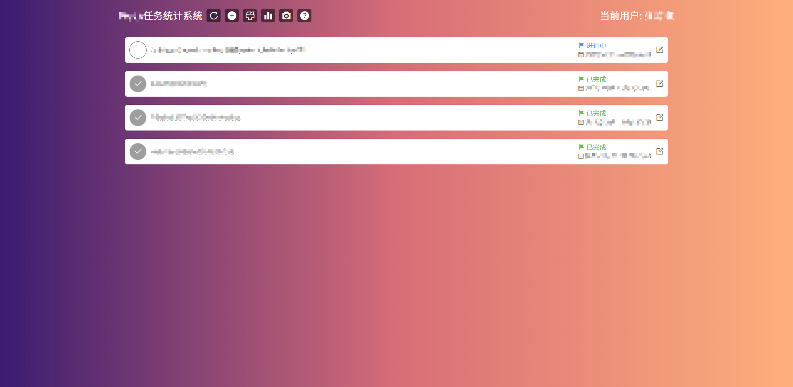

# oa-task-statistics

## Description
模仿 Microsoft To Do 页面完成的任务统计系统

## Features
- 换肤
- 统计用户
  - 添加任务
  - 编辑任务
  - 任务统计
  - 当前任务截图
- 管理员
  - 任务列表
  - 任务列表截图
## Backend
后端代码[@guoywcode]('https://github.com/guoywcode/oa-task-statistical')

## Picture
